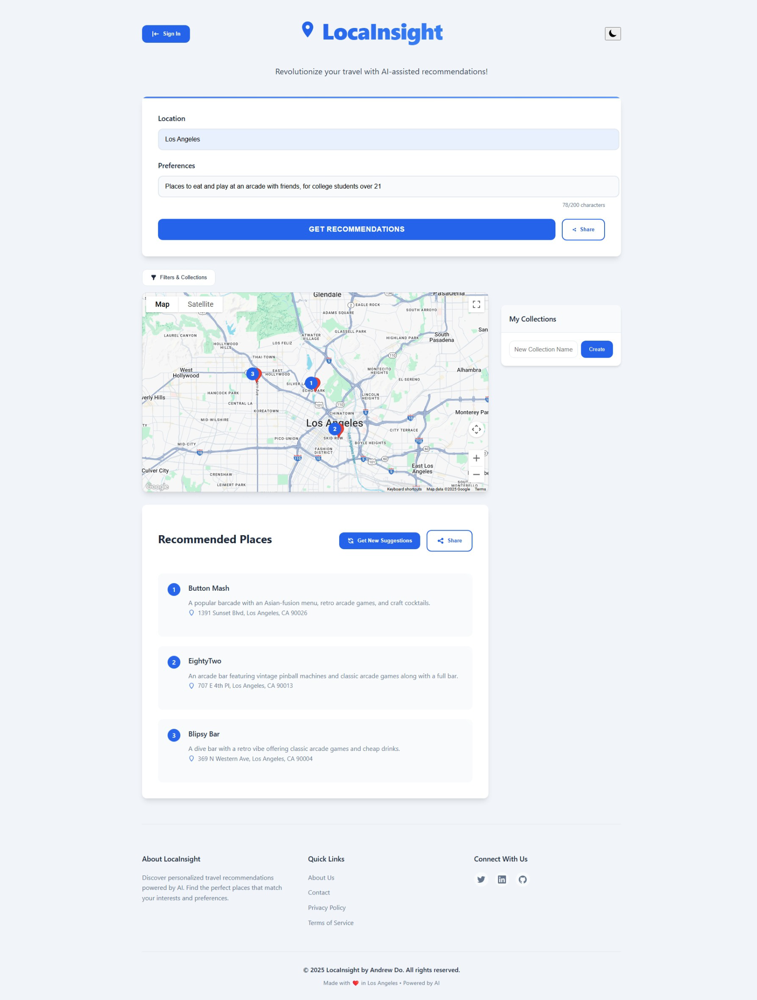

# LocaInsight



## Preview

**LocaInsight** is a travel exploration app that merges **OpenAI GPT-3.5** with the **Google Maps JavaScript API** to provide personalized travel recommendations and itineraries.

## Features
- **AI-Driven Recommendations:** Uses GPT-3.5 to generate tailored suggestions based on user input and preferences.
- **Interactive Map:** Displays recommended locations with markers on a Google Map.
- **Dynamic Centering:** Automatically centers the map on the first recommended location.
- **Data Validation:** Robust server-side validation for recommendations and user inputs.
- **Error Handling:** Comprehensive error handling with informative user feedback.

## Technologies
- **Backend:** Node.js, Express, OpenAI API (GPT-3.5 Turbo)
- **Frontend:** React, @react-google-maps/api, Axios
- **API Features:** Response caching, request validation

## Installation

1. **Server Setup:**
   - Navigate to the `server` folder and run:
     ```bash
     npm install
     ```
   - Create a `.env` file in `server` with:
     ```bash
     OPENAI_API_KEY=YOUR_OPENAI_API_KEY
     PORT=5000
     ```
   - Start the server:
     ```bash
     npm start
     ```

2. **Client Setup:**
   - Navigate to the `client` folder and run:
     ```bash
     npm install
     ```
   - In `client/src/App.js`, replace `"YOUR_GOOGLE_MAPS_API_KEY"` with your actual Google Maps API key.
   - Start the client:
     ```bash
     npm start
     ```

## Usage
- Open [http://localhost:5000](http://localhost:5000) in your browser.
- Enter a **Location** (e.g., "Paris") and your **Preferences** (e.g., "art museums, cafes").
- Click **Get Recommendations** to view AI-generated travel suggestions on the map and as a list.
- Each recommendation includes a name, description, address, and precise coordinates.

## License
This project is for demonstration purposes. Ensure you comply with the respective terms for the OpenAI API and Google Maps Platform when using it.
